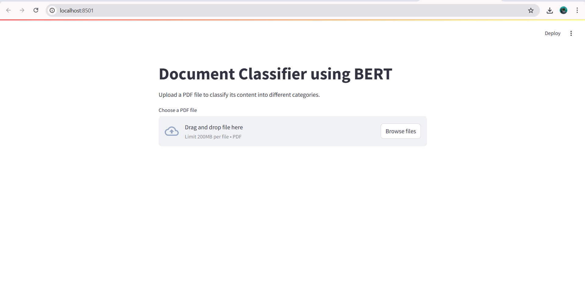
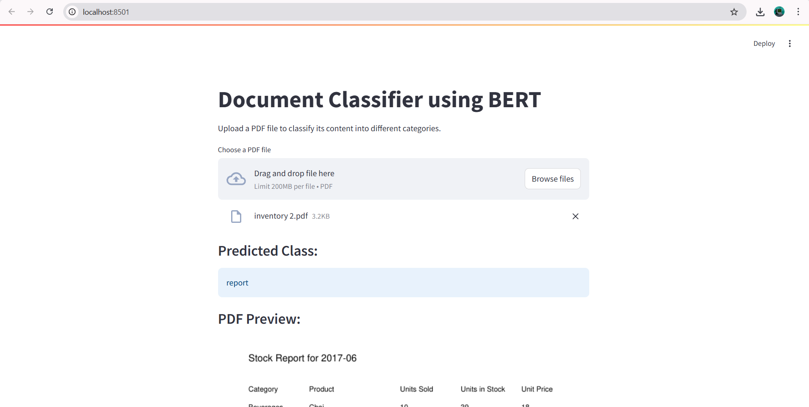

# 🧾 Document_Classification_using_BERT

## 📌 Project Overview
This project focuses on classifying business documents (like invoices, purchase orders, etc.) using a fine-tuned BERT model. It leverages powerful NLP techniques and a Transformer-based architecture to automatically detect the type of document from its textual content.

## 🚀 Features
✅ PDF file upload and preview

✅ Text extraction using PyPDF2

✅ Text preprocessing (cleaning, stopword removal, stemming)

✅ Fine-tuned BERT model for classification

✅ Real-time predictions via a Streamlit web app

---

## 📂 Project Structure

```

bash
Copy
Edit
Document_Classification_using_BERT/
│
├── bert_company_model/             # Fine-tuned BERT model
│
├── company-document-text.csv       # Raw dataset with document text and labels
│
├── label_encoder.pkl               # Pickled label encoder for decoding predictions
│
├── demo.py                         # Streamlit web app for document upload and prediction
│
├── Invoice Classification using BERT.ipynb  # Notebook for data prep, model training, and evaluation
│
├── requirements.txt                # Required Python packages
│
└── README.md                       # Project documentation
```

Document_Classification_using_BERT/
│
├── bert_company_model
├── label_encoder.pkl 
├── company-document-text.csv 
│
├── model_trainer.ipynb 
│
├── requirements.txt 
└── README.md 

## 💡 Future Improvements
✅ Add training and prediction logging

📈 Integrate evaluation metrics (Accuracy, F1, etc.)

🧠 Use DistilBERT or ALBERT for lightweight deployment

🌐 Deploy with Streamlit or FastAPI for UI-based inference

Below is a preview of the Streamlit application:



